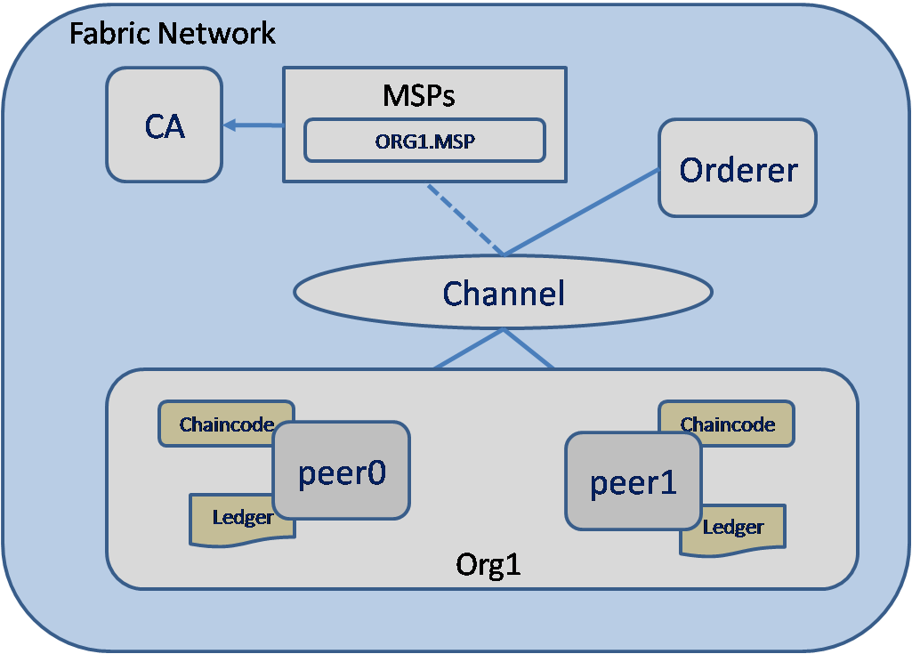
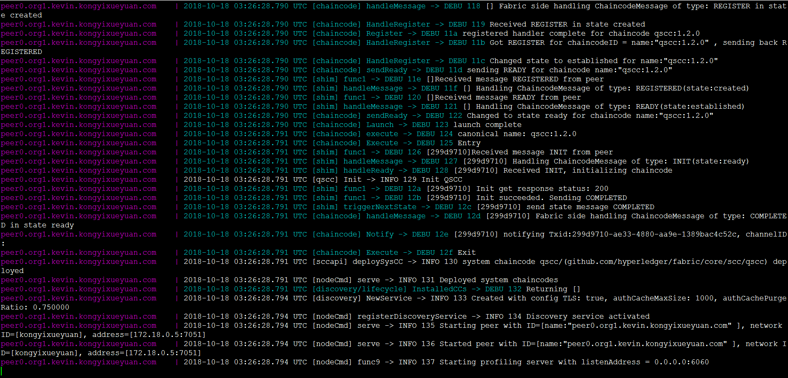
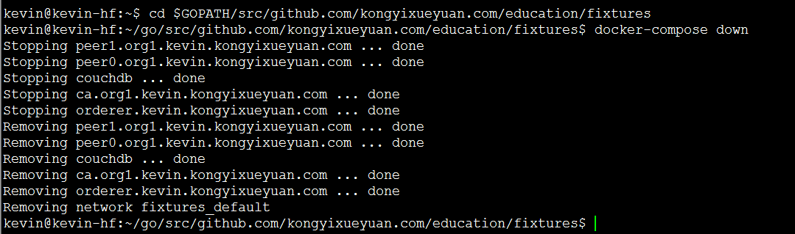
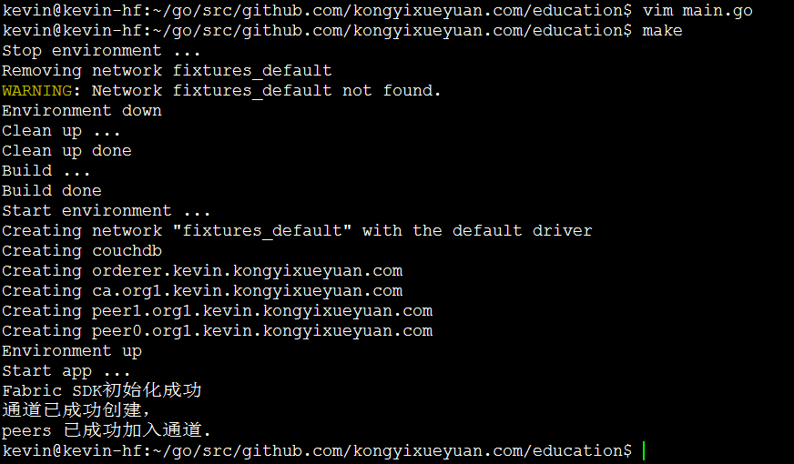
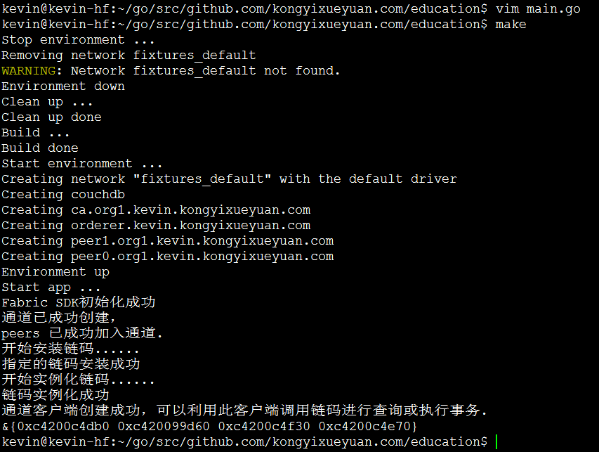
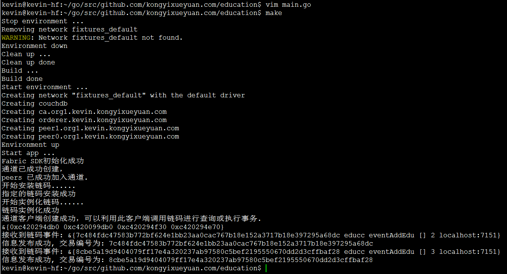

[TOC]

# 1. 需求分析与架构设计

## 1.1 需求分析

报警日志数据存储到Hyperledger Fabric中，提供接口接收数据，并且整合Hyperledger Explorer实现可以查看区块链列表和区块详情

## 1.2 架构设计


对于 `Fabric Network`结构如下图所示：



## 1.3 数据模型设计

由于需要向分类账本中保存数据，所以必须设计相关的结构体用于声明要保存的数据结构，用于方便的在应用中处理数据。

`Alarm` 结构体设计如下表所示：

| 名称           | 数据类型      | 说明                             |
| -------------- | ------------- | ------------------------------- |
| ObjectType     | string        |                                 |
| Id             | string        | 序列                            |
| SiteId         | string        | 站房                            |
| NoticeType     | string        | 报警类型                         |
| AlarmDetail    | string        | 报警详情                         |
| AlarmLevel     | string        | 报警级别                         |
| SiteType       | string        | 站房类型                         |
| TriggerValue   | string        | 触发值                           |
| AlarmDevice    | string        | 报警设备                         |
| AlarmParam     | string        | 报警参数                         |
| AlarmTime      | string        | 报警时间                         |
| Auditor        | string        | 审核员                           |
| Historys       | []HistoryItem | 当前alarm的详细历史记录             |

为了能够从当前的分类状态中查询出详细的历史操作记录，我们在 `Alarm` 中设计了一个类型为`HistoryItem` 数组的 `Historys` 成员，表示当前状态的历史记录集。

`HistoryItem` 结构体设计如下表所示：

| 名称      | 数据类型  | 说明                   |
| --------- | --------- | ---------------------- |
| TxId      | string    | 交易编号               |
| Alarm     | Alarm     | 本次历史记录的详细信息 |


## 1.4 网络环境

### 1.4.1 设置环境


在`GOPATH`的`src`文件夹中新建一个目录如下：

```shell
$ mkdir -p $GOPATH/src/github.com/kongyixueyuan.com/alarm
$ cd $GOPATH/src/github.com/kongyixueyuan.com/alarm
```

使用 `git` 命令克隆 hf-fixtures 目录当前路径

```shell
$ git clone https://github.com/kevin-hf/hf-fixtures.git
```

将 hf-fixtures 文件夹重命名为 fixtures

```shell
$ mv hf-fixtures/fixtures
```

修改`fixtures`  文件夹的所属关系为当前用户

```shell
$ sudo chown -R ubuntu:ubuntu ./fixtures
```

> 提示： kevin 为安装 Ubuntu 16.04 系统时创建的用户

进入 `fixtures` 目录

```shell
$ cd fixtures
```

为了构建区块链网络，使用 `docker` 构建处理不同角色的虚拟计算机。 在这里我们将尽可能保持简单。如果确定您的系统中已经存在相关的所需容器，或可以使用其它方式获取，则无需执行如下命令。否则请将 `fixtures` 目录下的 `pull_images.sh` 文件添加可执行权限后直接执行。

```shell
$ chmod 777 ./pull_images.sh
$ ./pull_images.sh 
```

> 提示：`pull_images.sh` 文件是下载 Fabric 环境所需容器的一个可执行脚本，下载过程需要一段时间（视网速情况而定），请耐心等待。另：请确定您的系统支持虚拟技术。

### 1.4.2 配置docker-compose.yml文件

在 `fixtures`  目录下创建一个 `docker-compose.yml`  文件并编辑

```shell
$ vim docker-compose.yml
```

1. 将  `network下的basic`   修改为  `default`

   ```yaml
   version: '2'
   
   networks:
     default:
   
   services:
   ```

2. 编辑  orderer 部分

   ```yaml
     orderer.kevin.kongyixueyuan.com:
       image: hyperledger/fabric-orderer
       container_name: orderer.kevin.kongyixueyuan.com
       environment:
         - ORDERER_GENERAL_LOGLEVEL=debug
         - ORDERER_GENERAL_LISTENADDRESS=0.0.0.0
         - ORDERER_GENERAL_LISTENPORT=7050
         - ORDERER_GENERAL_GENESISPROFILE=kongyixueyuan
         - ORDERER_GENERAL_GENESISMETHOD=file
         - ORDERER_GENERAL_GENESISFILE=/var/hyperledger/orderer/genesis.block
         - ORDERER_GENERAL_LOCALMSPID=kevin.kongyixueyuan.com
         - ORDERER_GENERAL_LOCALMSPDIR=/var/hyperledger/orderer/msp
         - ORDERER_GENERAL_TLS_ENABLED=true
         - ORDERER_GENERAL_TLS_PRIVATEKEY=/var/hyperledger/orderer/tls/server.key
         - ORDERER_GENERAL_TLS_CERTIFICATE=/var/hyperledger/orderer/tls/server.crt
         - ORDERER_GENERAL_TLS_ROOTCAS=[/var/hyperledger/orderer/tls/ca.crt]
       working_dir: /opt/gopath/src/github.com/hyperledger/fabric
       command: orderer
       volumes:
         - ./artifacts/genesis.block:/var/hyperledger/orderer/genesis.block
         - ./crypto-config/ordererOrganizations/kevin.kongyixueyuan.com/orderers/orderer.kevin.kongyixueyuan.com/msp:/var/hyperledger/orderer/msp
         - ./crypto-config/ordererOrganizations/kevin.kongyixueyuan.com/orderers/orderer.kevin.kongyixueyuan.com/tls:/var/hyperledger/orderer/tls
       ports:
         - 7050:7050
       networks:
         default:
           aliases:
             - orderer.kevin.kongyixueyuan.com
   ```

3. 编辑 ca 部分

   ```yaml
     ca.org1.kevin.kongyixueyuan.com:
       image: hyperledger/fabric-ca
       container_name: ca.org1.kevin.kongyixueyuan.com
       environment:
         - FABRIC_CA_HOME=/etc/hyperledger/fabric-ca-server
         - FABRIC_CA_SERVER_CA_NAME=ca.org1.kevin.kongyixueyuan.com
         - FABRIC_CA_SERVER_CA_CERTFILE=/etc/hyperledger/fabric-ca-server-config/ca.org1.kevin.kongyixueyuan.com-cert.pem
         - FABRIC_CA_SERVER_CA_KEYFILE=/etc/hyperledger/fabric-ca-server-config/727e69ed4a01a204cd53bf4a97c2c1cb947419504f82851f6ae563c3c96dea3a_sk
         - FABRIC_CA_SERVER_TLS_ENABLED=true
         - FABRIC_CA_SERVER_TLS_CERTFILE=/etc/hyperledger/fabric-ca-server-config/ca.org1.kevin.kongyixueyuan.com-cert.pem
         - FABRIC_CA_SERVER_TLS_KEYFILE=/etc/hyperledger/fabric-ca-server-config/727e69ed4a01a204cd53bf4a97c2c1cb947419504f82851f6ae563c3c96dea3a_sk
       ports:
         - 7054:7054
       command: sh -c 'fabric-ca-server start -b admin:adminpw -d'
       volumes:
         - ./crypto-config/peerOrganizations/org1.kevin.kongyixueyuan.com/ca/:/etc/hyperledger/fabric-ca-server-config
       networks:
         default:
           aliases:
             - ca.org1.kevin.kongyixueyuan.com
   ```

4. 声明 CouchDB 部分：

   ```yaml
     couchdb:
       container_name: couchdb
       image: hyperledger/fabric-couchdb
       # Populate the COUCHDB_USER and COUCHDB_PASSWORD to set an admin user and password
       # for CouchDB.  This will prevent CouchDB from operating in an "Admin Party" mode.
       environment:
         - COUCHDB_USER=
         - COUCHDB_PASSWORD=
       # Comment/Uncomment the port mapping if you want to hide/expose the CouchDB service,
       # for example map it to utilize Fauxton User Interface in dev environments.
       ports:
         - "5984:5984"
   ```

5. 编辑Peer部分

   1. `peer0.org1.example.com`  内容如下

      ```yaml
        peer0.org1.kevin.kongyixueyuan.com:
          image: hyperledger/fabric-peer
          container_name: peer0.org1.kevin.kongyixueyuan.com
          environment:
            - CORE_VM_ENDPOINT=unix:///host/var/run/docker.sock
            - CORE_VM_DOCKER_ATTACHSTDOUT=true
            - CORE_LOGGING_LEVEL=DEBUG
            - CORE_PEER_NETWORKID=kongyixueyuan
            - CORE_PEER_PROFILE_ENABLED=true
            - CORE_PEER_TLS_ENABLED=true
            - CORE_PEER_TLS_CERT_FILE=/var/hyperledger/tls/server.crt
            - CORE_PEER_TLS_KEY_FILE=/var/hyperledger/tls/server.key
            - CORE_PEER_TLS_ROOTCERT_FILE=/var/hyperledger/tls/ca.crt
            - CORE_PEER_ID=peer0.org1.kevin.kongyixueyuan.com
            - CORE_PEER_ADDRESSAUTODETECT=true
            - CORE_PEER_ADDRESS=peer0.org1.kevin.kongyixueyuan.com:7051
            - CORE_PEER_GOSSIP_EXTERNALENDPOINT=peer0.org1.kevin.kongyixueyuan.com:7051
            - CORE_PEER_GOSSIP_USELEADERELECTION=true
            - CORE_PEER_GOSSIP_ORGLEADER=false
            - CORE_PEER_GOSSIP_SKIPHANDSHAKE=true
            - CORE_PEER_LOCALMSPID=org1.kevin.kongyixueyuan.com
            - CORE_PEER_MSPCONFIGPATH=/var/hyperledger/msp
            - CORE_PEER_TLS_SERVERHOSTOVERRIDE=peer0.org1.kevin.kongyixueyuan.com
            - CORE_LEDGER_STATE_STATEDATABASE=CouchDB
            - CORE_LEDGER_STATE_COUCHDBCONFIG_COUCHDBADDRESS=couchdb:5984
            - CORE_LEDGER_STATE_COUCHDBCONFIG_USERNAME=
            - CORE_LEDGER_STATE_COUCHDBCONFIG_PASSWORD=
          working_dir: /opt/gopath/src/github.com/hyperledger/fabric/peer
          command: peer node start
          volumes:
            - /var/run/:/host/var/run/
            - ./crypto-config/peerOrganizations/org1.kevin.kongyixueyuan.com/peers/peer0.org1.kevin.kongyixueyuan.com/msp:/var/hyperledger/msp
            - ./crypto-config/peerOrganizations/org1.kevin.kongyixueyuan.com/peers/peer0.org1.kevin.kongyixueyuan.com/tls:/var/hyperledger/tls
          ports:
            - 7051:7051
            - 7053:7053
          depends_on:
            - orderer.kevin.kongyixueyuan.com
            - couchdb
          networks:
            default:
              aliases:
                - peer0.org1.kevin.kongyixueyuan.com
      ```

   2. peer1.org1.example.com 内容如下

      ```yaml
        peer1.org1.kevin.kongyixueyuan.com:
          image: hyperledger/fabric-peer
          container_name: peer1.org1.kevin.kongyixueyuan.com
          environment:
            - CORE_VM_ENDPOINT=unix:///host/var/run/docker.sock
            - CORE_VM_DOCKER_ATTACHSTDOUT=true
            - CORE_LOGGING_LEVEL=DEBUG
            - CORE_PEER_NETWORKID=kongyixueyuan
            - CORE_PEER_PROFILE_ENABLED=true
            - CORE_PEER_TLS_ENABLED=true
            - CORE_PEER_TLS_CERT_FILE=/var/hyperledger/tls/server.crt
            - CORE_PEER_TLS_KEY_FILE=/var/hyperledger/tls/server.key
            - CORE_PEER_TLS_ROOTCERT_FILE=/var/hyperledger/tls/ca.crt
            - CORE_PEER_ID=peer1.org1.kevin.kongyixueyuan.com
            - CORE_PEER_ADDRESSAUTODETECT=true
            - CORE_PEER_ADDRESS=peer1.org1.kevin.kongyixueyuan.com:7051
            - CORE_PEER_GOSSIP_EXTERNALENDPOINT=peer1.org1.kevin.kongyixueyuan.com:7051
            - CORE_PEER_GOSSIP_USELEADERELECTION=true
            - CORE_PEER_GOSSIP_ORGLEADER=false
            - CORE_PEER_GOSSIP_SKIPHANDSHAKE=true
            - CORE_PEER_LOCALMSPID=org1.kevin.kongyixueyuan.com
            - CORE_PEER_MSPCONFIGPATH=/var/hyperledger/msp
            - CORE_PEER_TLS_SERVERHOSTOVERRIDE=peer1.org1.kevin.kongyixueyuan.com
            - CORE_LEDGER_STATE_STATEDATABASE=CouchDB
            - CORE_LEDGER_STATE_COUCHDBCONFIG_COUCHDBADDRESS=couchdb:5984
            - CORE_LEDGER_STATE_COUCHDBCONFIG_USERNAME=
            - CORE_LEDGER_STATE_COUCHDBCONFIG_PASSWORD=
          working_dir: /opt/gopath/src/github.com/hyperledger/fabric/peer
          command: peer node start
          volumes:
            - /var/run/:/host/var/run/
            - ./crypto-config/peerOrganizations/org1.kevin.kongyixueyuan.com/peers/peer1.org1.kevin.kongyixueyuan.com/msp:/var/hyperledger/msp
            - ./crypto-config/peerOrganizations/org1.kevin.kongyixueyuan.com/peers/peer1.org1.kevin.kongyixueyuan.com/tls:/var/hyperledger/tls
          ports:
            - 7151:7051
            - 7153:7053
          depends_on:
            - orderer.kevin.kongyixueyuan.com
            - couchdb
          networks:
            default:
              aliases:
                - peer1.org1.kevin.kongyixueyuan.com
      ```

## 1.5 测试网络环境

为了检查网络是否正常工作，使用`docker-compose`同时启动或停止所有容器。 进入`fixtures`文件夹，运行：

```shell
$ cd $GOPATH/src/github.com/kongyixueyuan.com/alarm/fixtures
$ docker-compose up
```

控制台会输出很多不同颜色的日志（红色不等于错误）



打开一个新终端并运行：

```shell
 $ docker ps 
```


将看到：两个peer，一个orderer和一个CA容器，还有一个 CouchDB 容器。 代表已成功创建了一个新的网络，可以随SDK一起使用。 要停止网络，请返回到上一个终端，按`Ctrl+C`并等待所有容器都停止。 

> **提示** ：当网络成功启动后，所有处于活动中的容器都可以访问。 也可以查看指定容器的详细日志内容。  如果想删除这些容器，需要使用`docker rm $(docker ps -aq)`将其删除 ，但在删除容器之前需要确定其在网络环境中已不再使用。
>
> 如果在网络环境启动过程中不想看到大量的日志信息，请在该启动命令中添加参数 `-d` ，如下所示： `docker-compose up -d` 。 如果要停止网络，请务必在 `docker-compose.yaml` 所在的文件夹中运行命令： `docker-compose stop` （或 使用`docker-compose down` 进行清理停止所有容器）。

最后在终端2中执行如下命令关闭网络：

```shell
$ cd $GOPATH/src/github.com/kongyixueyuan.com/alarm/fixtures
$ docker-compose down
```




终端1窗口中输出如下：


# 2 SDK与链码实现

## 2.1 创建 config.yaml 文件

确认 Hyperledger Fabric 基础网络环境运行没有问题后，现在我们通过创建一个新的 config.yaml 配置文件给应用程序所使用的 Fabric-SDK-Go 配置相关参数及 Fabric 组件的通信地址

进入项目的根目录中创建一个 `config.yaml` 文件并编辑

```shell
$ cd $GOPATH/src/github.com/kongyixueyuan.com/alarm
$ vim config.yaml
```

config.yaml 配置文件完整内容如下:

```yaml
name: "kongyixueyuan-network"
#
# Schema version of the content. Used by the SDK to apply the corresponding parsing rules.
#
version: 1.0.0

#
# The client section used by GO SDK.
#
client:

  # Which organization does this application instance belong to? The value must be the name of an org
  # defined under "organizations"
  organization: Org1

  logging:
    level: info

  # Global configuration for peer, event service and orderer timeouts
  # if this this section is omitted, then default values will be used (same values as below)
#  peer:
#    timeout:
#      connection: 10s
#      response: 180s
#      discovery:
#        # Expiry period for discovery service greylist filter
#        # The channel client will greylist peers that are found to be offline
#        # to prevent re-selecting them in subsequent retries.
#        # This interval will define how long a peer is greylisted
#        greylistExpiry: 10s
#  eventService:
#    # Event service type (optional). If not specified then the type is automatically
#    # determined from channel capabilities.
#    type: (deliver|eventhub)
    # the below timeouts are commented out to use the default values that are found in
    # "pkg/fab/endpointconfig.go"
    # the client is free to override the default values by uncommenting and resetting
    # the values as they see fit in their config file
#    timeout:
#      connection: 15s
#      registrationResponse: 15s
#  orderer:
#    timeout:
#      connection: 15s
#      response: 15s
#  global:
#    timeout:
#      query: 180s
#      execute: 180s
#      resmgmt: 180s
#    cache:
#      connectionIdle: 30s
#      eventServiceIdle: 2m
#      channelConfig: 30m
#      channelMembership: 30s
#      discovery: 10s
#      selection: 10m

  # Root of the MSP directories with keys and certs.
  cryptoconfig:
    path: ${GOPATH}/src/github.com/kongyixueyuan.com/alarm/fixtures/crypto-config

  # Some SDKs support pluggable KV stores, the properties under "credentialStore"
  # are implementation specific
  credentialStore:
    path: /tmp/kongyixueyuan-store

    # [Optional]. Specific to the CryptoSuite implementation used by GO SDK. Software-based implementations
    # requiring a key store. PKCS#11 based implementations does not.
    cryptoStore:
      path: /tmp/kongyixueyuan-msp

   # BCCSP config for the client. Used by GO SDK.
  BCCSP:
    security:
     enabled: true
     default:
      provider: "SW"
     hashAlgorithm: "SHA2"
     softVerify: true
     level: 256

  tlsCerts:
    # [Optional]. Use system certificate pool when connecting to peers, orderers (for negotiating TLS) Default: false
    systemCertPool: false

    # [Optional]. Client key and cert for TLS handshake with peers and orderers
    client:
      key:
        path:
      cert:
        path:

#
# [Optional]. But most apps would have this section so that channel objects can be constructed
# based on the content below. If an app is creating channels, then it likely will not need this
# section.
#
channels:
  # name of the channel
  kevinkongyixueyuan:
    # Required. list of orderers designated by the application to use for transactions on this
    # channel. This list can be a result of access control ("org1" can only access "ordererA"), or
    # operational decisions to share loads from applications among the orderers.  The values must
    # be "names" of orgs defined under "organizations/peers"
    # deprecated: not recommended, to override any orderer configuration items, entity matchers should be used.
    # orderers:
    #  - orderer.kevin.kongyixueyuan.com

    # Required. list of peers from participating orgs
    peers:
      peer0.org1.kevin.kongyixueyuan.com:
        # [Optional]. will this peer be sent transaction proposals for endorsement? The peer must
        # have the chaincode installed. The app can also use this property to decide which peers
        # to send the chaincode install request. Default: true
        endorsingPeer: true

        # [Optional]. will this peer be sent query proposals? The peer must have the chaincode
        # installed. The app can also use this property to decide which peers to send the
        # chaincode install request. Default: true
        chaincodeQuery: true

        # [Optional]. will this peer be sent query proposals that do not require chaincodes, like
        # queryBlock(), queryTransaction(), etc. Default: true
        ledgerQuery: true

        # [Optional]. will this peer be the target of the SDK's listener registration? All peers can
        # produce events but the app typically only needs to connect to one to listen to events.
        # Default: true
        eventSource: true

      peer1.org1.kevin.kongyixueyuan.com:
        endorsingPeer: true
        chaincodeQuery: true
        ledgerQuery: true
        eventSource: true

    policies:
      #[Optional] options for retrieving channel configuration blocks
      queryChannelConfig:
        #[Optional] min number of success responses (from targets/peers)
        minResponses: 1
        #[Optional] channel config will be retrieved for these number of random targets
        maxTargets: 1
        #[Optional] retry options for query config block
        retryOpts:
          #[Optional] number of retry attempts
          attempts: 5
          #[Optional] the back off interval for the first retry attempt
          initialBackoff: 500ms
          #[Optional] the maximum back off interval for any retry attempt
          maxBackoff: 5s
          #[Optional] he factor by which the initial back off period is exponentially incremented
          backoffFactor: 2.0
      #[Optional] options for retrieving discovery info
      discovery:
        #[Optional] discovery info will be retrieved for these number of random targets
        maxTargets: 2
        #[Optional] retry options for retrieving discovery info
        retryOpts:
          #[Optional] number of retry attempts
          attempts: 4
          #[Optional] the back off interval for the first retry attempt
          initialBackoff: 500ms
          #[Optional] the maximum back off interval for any retry attempt
          maxBackoff: 5s
          #[Optional] he factor by which the initial back off period is exponentially incremented
          backoffFactor: 2.0
      #[Optional] options for the event service
      eventService:
        # [Optional] resolverStrategy specifies the peer resolver strategy to use when connecting to a peer
        # Possible values: [PreferOrg (default), MinBlockHeight, Balanced]
        #
        # PreferOrg:
        #   Determines which peers are suitable based on block height lag threshold, although will prefer the peers in the
        #   current org (as long as their block height is above a configured threshold). If none of the peers from the current org
        #   are suitable then a peer from another org is chosen.
        # MinBlockHeight:
        #   Chooses the best peer according to a block height lag threshold. The maximum block height of all peers is
        #   determined and the peers whose block heights are under the maximum height but above a provided "lag" threshold are load
        #   balanced. The other peers are not considered.
        # Balanced:
        #   Chooses peers using the configured balancer.
        resolverStrategy: PreferOrg
        # [Optional] balancer is the balancer to use when choosing a peer to connect to
        # Possible values: [Random (default), RoundRobin]
        balancer: Random
        # [Optional] blockHeightLagThreshold sets the block height lag threshold. This value is used for choosing a peer
        # to connect to. If a peer is lagging behind the most up-to-date peer by more than the given number of
        # blocks then it will be excluded from selection.
        # If set to 0 then only the most up-to-date peers are considered.
        # If set to -1 then all peers (regardless of block height) are considered for selection.
        # Default: 5
        blockHeightLagThreshold: 5
        # [Optional] reconnectBlockHeightLagThreshold - if >0 then the event client will disconnect from the peer if the peer's
        # block height falls behind the specified number of blocks and will reconnect to a better performing peer.
        # If set to 0 then this feature is disabled.
        # Default: 10
        # NOTES:
        #   - peerMonitorPeriod must be >0 to enable this feature
        #   - Setting this value too low may cause the event client to disconnect/reconnect too frequently, thereby
        #     affecting performance.
        reconnectBlockHeightLagThreshold: 10
        # [Optional] peerMonitorPeriod is the period in which the connected peer is monitored to see if
        # the event client should disconnect from it and reconnect to another peer.
        # Default: 0 (disabled)
        peerMonitorPeriod: 5s

#
# list of participating organizations in this network
#
organizations:
  Org1:
    mspid: org1.kevin.kongyixueyuan.com
    cryptoPath: peerOrganizations/org1.kevin.kongyixueyuan.com/users/{userName}@org1.kevin.kongyixueyuan.com/msp
    peers:
      - peer0.org1.kevin.kongyixueyuan.com
      - peer1.org1.kevin.kongyixueyuan.com

    # [Optional]. Certificate Authorities issue certificates for identification purposes in a Fabric based
    # network. Typically certificates provisioning is done in a separate process outside of the
    # runtime network. Fabric-CA is a special certificate authority that provides a REST APIs for
    # dynamic certificate management (enroll, revoke, re-enroll). The following section is only for
    # Fabric-CA servers.
    certificateAuthorities:
      - ca.org1.kevin.kongyixueyuan.com

#
# List of orderers to send transaction and channel create/update requests to. For the time
# being only one orderer is needed. If more than one is defined, which one get used by the
# SDK is implementation specific. Consult each SDK's documentation for its handling of orderers.
#
orderers:
  orderer.kevin.kongyixueyuan.com:
    url: localhost:7050

    # these are standard properties defined by the gRPC library
    # they will be passed in as-is to gRPC client constructor
    grpcOptions:
      ssl-target-name-override: orderer.kevin.kongyixueyuan.com
      # These parameters should be set in coordination with the keepalive policy on the server,
      # as incompatible settings can result in closing of connection.
      # When duration of the 'keep-alive-time' is set to 0 or less the keep alive client parameters are disabled
      keep-alive-time: 0s
      keep-alive-timeout: 20s
      keep-alive-permit: false
      fail-fast: false
      # allow-insecure will be taken into consideration if address has no protocol defined, if true then grpc or else grpcs
      allow-insecure: false

    tlsCACerts:
      # Certificate location absolute path
      path: ${GOPATH}/src/github.com/kongyixueyuan.com/alarm/fixtures/crypto-config/ordererOrganizations/kevin.kongyixueyuan.com/tlsca/tlsca.kevin.kongyixueyuan.com-cert.pem

#
# List of peers to send various requests to, including endorsement, query
# and event listener registration.
#
peers:
  peer0.org1.kevin.kongyixueyuan.com:
    # this URL is used to send endorsement and query requests
    url: localhost:7051
    # eventUrl is only needed when using eventhub (default is delivery service)
    eventUrl: localhost:7053

    grpcOptions:
      ssl-target-name-override: peer0.org1.kevin.kongyixueyuan.com
      # These parameters should be set in coordination with the keepalive policy on the server,
      # as incompatible settings can result in closing of connection.
      # When duration of the 'keep-alive-time' is set to 0 or less the keep alive client parameters are disabled
      keep-alive-time: 0s
      keep-alive-timeout: 20s
      keep-alive-permit: false
      fail-fast: false
      # allow-insecure will be taken into consideration if address has no protocol defined, if true then grpc or else grpcs
      allow-insecure: false

    tlsCACerts:
      # Certificate location absolute path
      path: ${GOPATH}/src/github.com/kongyixueyuan.com/alarm/fixtures/crypto-config/peerOrganizations/org1.kevin.kongyixueyuan.com/tlsca/tlsca.org1.kevin.kongyixueyuan.com-cert.pem

  peer1.org1.kevin.kongyixueyuan.com:
    # this URL is used to send endorsement and query requests
    url: localhost:7151
    # eventUrl is only needed when using eventhub (default is delivery service)
    eventUrl: localhost:7153

    grpcOptions:
      ssl-target-name-override: peer1.org1.kevin.kongyixueyuan.com
      # These parameters should be set in coordination with the keepalive policy on the server,
      # as incompatible settings can result in closing of connection.
      # When duration of the 'keep-alive-time' is set to 0 or less the keep alive client parameters are disabled
      keep-alive-time: 0s
      keep-alive-timeout: 20s
      keep-alive-permit: false
      fail-fast: false
      # allow-insecure will be taken into consideration if address has no protocol defined, if true then grpc or else grpcs
      allow-insecure: false

    tlsCACerts:
      # Certificate location absolute path
      path: ${GOPATH}/src/github.com/kongyixueyuan.com/alarm/fixtures/crypto-config/peerOrganizations/org1.kevin.kongyixueyuan.com/tlsca/tlsca.org1.kevin.kongyixueyuan.com-cert.pem

#
# Fabric-CA is a special kind of Certificate Authority provided by Hyperledger Fabric which allows
# certificate management to be done via REST APIs. Application may choose to use a standard
# Certificate Authority instead of Fabric-CA, in which case this section would not be specified.
#
certificateAuthorities:
  ca.org1.kevin.kongyixueyuan.com:
    url: http://localhost:7054
    tlsCACerts:
      # Certificate location absolute path
      path: ${GOPATH}/src/github.com/kongyixueyuan.com/alarm/fixtures/crypto-config/peerOrganizations/org1.kevin.kongyixueyuan.com/ca/ca.org1.kevin.kongyixueyuan.com-cert.pem

    # Fabric-CA supports dynamic user enrollment via REST APIs. A "root" user, a.k.a registrar, is
    # needed to enroll and invoke new users.
    registrar:
      enrollId: admin
      enrollSecret: adminpw
    # [Optional] The optional name of the CA.
    caName: ca.org1.kevin.kongyixueyuan.com

entityMatchers:
  peer:
    - pattern: (\w*)peer0.org1.kevin.kongyixueyuan.com(\w*)
      urlSubstitutionExp: localhost:7051
      eventUrlSubstitutionExp: localhost:7053
      sslTargetOverrideUrlSubstitutionExp: peer0.org1.kevin.kongyixueyuan.com
      mappedHost: peer0.org1.kevin.kongyixueyuan.com

    - pattern: (\w*)peer1.org1.kevin.kongyixueyuan.com(\w*)
      urlSubstitutionExp: localhost:7151
      eventUrlSubstitutionExp: localhost:7153
      sslTargetOverrideUrlSubstitutionExp: peer1.org1.kevin.kongyixueyuan.com
      mappedHost: peer1.org1.kevin.kongyixueyuan.com

  orderer:
    - pattern: (\w*)orderer.kevin.kongyixueyuan.com(\w*)
      urlSubstitutionExp: localhost:7050
      sslTargetOverrideUrlSubstitutionExp: orderer.kevin.kongyixueyuan.com
      mappedHost: orderer.kevin.kongyixueyuan.com

  certificateAuthorities:
    - pattern: (\w*)ca.org1.kevin.kongyixueyuan.com(\w*)
      urlSubstitutionExp: http://localhost:7054
      mappedHost: ca.org1.kevin.kongyixueyuan.com
```


## 2.2 声明结构体

在当前项目根目录中创建一个存放链码文件的 `chaincode` 目录，然后在该目录下创建一个 `alarmStruct.go` 的文件并对其进行编辑

```shell
$ mkdir chaincode
$ vim chaincode/alarmStruct.go
```

`alarmStruct.go` 文件主要声明一个结构体，用于将多个数据包装成为一个对象，然后进行进一步的处理。该文件完整代码如下：

```go
/**
  @Author : hm
*/
package main

type Alarm struct {
	ObjectType	string	`json:"docType"`
    Id          string  `json:"Id"`	                //站房
    SiteId      string  `json:"SiteId"`	            //站房
    NoticeType       string  `json:"NoticeType"`	//通知类型
    AlarmDetail       string  `json:"AlarmDetail"`	//报警详情

    AlarmLevel       string  `json:"AlarmLevel"`	//报警级别

    SiteType         string  `json:"SiteType"`		//站房类型

    TriggerValue     string  `json:"TriggerValue"`	//触发值
    AlarmParam       string  `json:"AlarmParam"`	//报警参数
    AlarmTime        string  `json:"AlarmTime"`		//报警时间
    Auditor          string  `json:"Auditor"`		//作者
    Historys	     []HistoryItem	                //当前alarm的历史记录
}

type HistoryItem struct {
	TxId	   string
	Alarm	   Alarm
}
```


## 2.3 编写链码

在 `chaincode` 目录下创建一个 `main.go` 的文件并对其进行编辑

```shell
$ vim chaincode/main.go
```

`main.go` 文件作为链码的主文件，主要声明 `Init(stub shim.ChaincodeStubInterface)、Invoke(stub shim.ChaincodeStubInterface)  `  函数，完成对链码初始化及调用的相关实现，完整代码如下：

```go
/**
  @Author : hm
*/
package main

import (
	"github.com/hyperledger/fabric/core/chaincode/shim"
	"fmt"
	"github.com/hyperledger/fabric/protos/peer"
)

type AlarmChaincode struct {

}

func (t *AlarmChaincode) Init(stub shim.ChaincodeStubInterface) peer.Response{

	return shim.Success(nil)
}

func (t *AlarmChaincode) Invoke(stub shim.ChaincodeStubInterface) peer.Response{
	// 获取用户意图
	fun, args := stub.GetFunctionAndParameters()

	if fun == "addAlarm"{
		return t.addAlarm(stub, args)		// 添加信息
	}

	return shim.Error("指定的函数名称错误")

}

func main(){
	err := shim.Start(new(AlarmChaincode))
	if err != nil{
		fmt.Printf("启动AlarmChaincode时发生错误: %s", err)
	}
}
```


创建 `alarmCC.go` 文件，该文件实现了使用链码相关的API对分类账本状态进行具体操作的各个函数：

- **PutAlarm：**实现将指定的对象序列化后保存至分类账本中
- **addAlarm：**接收对象并调用 `PutAlarm` 函数实现保存状态的功能


`alarmCC.go` 文件完整内容如下：

```go
/**
  @Author : hm
*/

package main

import (
	"github.com/hyperledger/fabric/core/chaincode/shim"
	"github.com/hyperledger/fabric/protos/peer"
	"encoding/json"
	"fmt"
	"bytes"
)

const DOC_TYPE = "alarmObj"

// 保存alarm
// args: alarm
func PutAlarm(stub shim.ChaincodeStubInterface, alarm Alarm) ([]byte, bool) {

	alarm.ObjectType = DOC_TYPE

	b, err := json.Marshal(alarm)
	if err != nil {
		return nil, false
	}

	// 保存alarm状态
	err = stub.PutState(alarm.Id, b)
	if err != nil {
		return nil, false
	}

	return b, true
}

// 添加信息
// args: alarmObject
func (t *AlarmChaincode) addAlarm(stub shim.ChaincodeStubInterface, args []string) peer.Response {

	if len(args) != 2{
		return shim.Error("给定的参数个数不符合要求")
	}

	var alarm Alarm
	err := json.Unmarshal([]byte(args[0]), &alarm)
	if err != nil {
		return shim.Error("反序列化信息时发生错误")
	}

	_, bl := PutAlarm(stub, alarm)
	if !bl {
		return shim.Error("保存信息时发生错误")
	}

	err = stub.SetEvent(args[1], []byte{})
	if err != nil {
		return shim.Error(err.Error())
	}

	return shim.Success([]byte("信息添加成功"))
}

```


## 2.4 SDK实现

链码编写好以后，我们需要使用 Fabric-SDK-Go 提供的相关 API 来实现对链码的安装及实例化操作，而无需在命令提示符中输入烦锁的相关操作命令。接下来依次完成如下步骤：

### 2.4.1 创建SDK

在 `sdkInit` 目录下新创建一个名为 `start.go` 的go文件利用 vim 编辑器进行编辑：

```shell
$ cd $GOPATH/src/github.com/kongyixueyuan.com/alarm
$ vim sdkInit/start.go 
```

```go
/**
  author: hm
 */
package sdkInit

import (
	"github.com/hyperledger/fabric-sdk-go/pkg/fabsdk"
	"github.com/hyperledger/fabric-sdk-go/pkg/core/config"
	"fmt"
	"github.com/hyperledger/fabric-sdk-go/pkg/client/resmgmt"
	mspclient "github.com/hyperledger/fabric-sdk-go/pkg/client/msp"
	"github.com/hyperledger/fabric-sdk-go/pkg/common/providers/msp"
	"github.com/hyperledger/fabric-sdk-go/pkg/common/errors/retry"

)

const ChaincodeVersion  = "1.0"

func SetupSDK(ConfigFile string, initialized bool) (*fabsdk.FabricSDK, error) {

	if initialized {
		return nil, fmt.Errorf("Fabric SDK已被实例化")
	}

	sdk, err := fabsdk.New(config.FromFile(ConfigFile))
	if err != nil {
		return nil, fmt.Errorf("实例化Fabric SDK失败: %v", err)
	}

	fmt.Println("Fabric SDK初始化成功")
	return sdk, nil
}

func CreateChannel(sdk *fabsdk.FabricSDK, info *InitInfo) error {

	clientContext := sdk.Context(fabsdk.WithUser(info.OrgAdmin), fabsdk.WithOrg(info.OrgName))
	if clientContext == nil {
		return fmt.Errorf("根据指定的组织名称与管理员创建资源管理客户端Context失败")
	}

	// New returns a resource management client instance.
	resMgmtClient, err := resmgmt.New(clientContext)
	if err != nil {
		return fmt.Errorf("根据指定的资源管理客户端Context创建通道管理客户端失败: %v", err)
	}

	// New creates a new Client instance
	mspClient, err := mspclient.New(sdk.Context(), mspclient.WithOrg(info.OrgName))
	if err != nil {
		return fmt.Errorf("根据指定的 OrgName 创建 Org MSP 客户端实例失败: %v", err)
	}

	//  Returns: signing identity
	adminIdentity, err := mspClient.GetSigningIdentity(info.OrgAdmin)
	if err != nil {
		return fmt.Errorf("获取指定id的签名标识失败: %v", err)
	}

	// SaveChannelRequest holds parameters for save channel request
	channelReq := resmgmt.SaveChannelRequest{ChannelID:info.ChannelID, ChannelConfigPath:info.ChannelConfig, SigningIdentities:[]msp.SigningIdentity{adminIdentity}}
	// save channel response with transaction ID
	 _, err = resMgmtClient.SaveChannel(channelReq, resmgmt.WithRetry(retry.DefaultResMgmtOpts), resmgmt.WithOrdererEndpoint(info.OrdererOrgName))
	if err != nil {
		return fmt.Errorf("创建应用通道失败: %v", err)
	}

	fmt.Println("通道已成功创建，")

	info.OrgResMgmt = resMgmtClient

	// allows for peers to join existing channel with optional custom options (specific peers, filtered peers). If peer(s) are not specified in options it will default to all peers that belong to client's MSP.
	err = info.OrgResMgmt.JoinChannel(info.ChannelID, resmgmt.WithRetry(retry.DefaultResMgmtOpts), resmgmt.WithOrdererEndpoint(info.OrdererOrgName))
	if err != nil {
		return fmt.Errorf("Peers加入通道失败: %v", err)
	}

	fmt.Println("peers 已成功加入通道.")
	return nil
}
```

在这个阶段，我们只初始化一个客户端，它将与 peer，CA 和 orderer进行通信。 还创建了一个指定的应用通道, 并将 Peer 节点加入到此通道中

### 2.4.2 编写测试代码

为了确保客户端能够初始化所有组件，将在启动网络的情况下进行简单的测试。 为了做到这一点，我们需要编写 Go 代码，在项目根目录下新创建一个 `main.go` 的主文件并编辑内容

```shell
$ cd $GOPATH/src/github.com/kongyixueyuan.com/alarm
$ vim main.go
```

`main.go` 文件完整源代码如下：

```go
/**
  author: hm
 */
package main

import (
	"os"
	"fmt"
	"github.com/kongyixueyuan.com/alarm/sdkInit"
)

const (
	configFile = "config.yaml"
	initialized = false
	SimpleCC = "alarmcc"
)

func main() {

	initInfo := &sdkInit.InitInfo{

		ChannelID: "kevinkongyixueyuan",
		ChannelConfig: os.Getenv("GOPATH") + "/src/github.com/kongyixueyuan.com/alarm/fixtures/artifacts/channel.tx",

		OrgAdmin:"Admin",
		OrgName:"Org1",
		OrdererOrgName: "orderer.kevin.kongyixueyuan.com",

	}

	sdk, err := sdkInit.SetupSDK(configFile, initialized)
	if err != nil {
		fmt.Printf(err.Error())
		return
	}

	defer sdk.Close()

	err = sdkInit.CreateChannel(sdk, initInfo)
	if err != nil {
		fmt.Println(err.Error())
		return
	}

}
```


### 2.5 安装dep工具

在运行应用程序之前，需要将 Go 源代码时行编译，但在开始编译之前，我们需要使用一个 `vendor` 目录来包含应用中所需的所有的依赖关系。 在我们的GOPATH中，我们有Fabric SDK Go和其他项目。 在尝试编译应用程序时，Golang 会在 GOPATH 中搜索依赖项，但首先会检查项目中是否存在`vendor` 文件夹。 如果依赖性得到满足，那么 Golang 就不会去检查 GOPATH 或 GOROOT。 这在使用几个不同版本的依赖关系时非常有用（可能会发生一些冲突，比如在例子中有多个BCCSP定义，通过使用像[`dep`](https://translate.googleusercontent.com/translate_c?depth=1&hl=zh-CN&rurl=translate.google.com&sl=en&sp=nmt4&tl=zh-CN&u=https://github.com/golang/dep&xid=25657,15700002,15700019,15700124,15700149,15700168,15700186,15700201&usg=ALkJrhgelyRl7D3pIJRpuA8cynagkWYHXg)这样的工具在`vendor`目录中来处理这些依赖关系。

将如下环境变量设置到用户的环境文件中(.bashrc)中

```shell
$ vim ~/.bashrc

export PATH=$PATH:$GOPATH/bin
```

执行 `source` 命令

```shell
$ source ~/.bashrc
```

安装 dep 工具

```shell
$ go get -u github.com/golang/dep/cmd/dep
```

### 2.5.1 下载所需依赖

`dep` 工具安装好之后我们来安装应用所需要的依赖

使用 `dep` 命令需要一个名为 `Gopkg.toml` 的配置文件指定依赖信息

创建一个名为`Gopkg.toml`的文件并将其复制到里面：

```shell
$ vim Gopkg.toml
```

```toml
ignored = ["github.com/kongyixueyuan.com/alarm/chaincode"]

[[constraint]]
  # Release v1.0.0-alpha4
  name = "github.com/hyperledger/fabric-sdk-go"
  revision = "a906355f73d060d7bf95874a9e90dc17589edbb3"

```

使用`dep`限制在 vendor 中指定希望SDK的特定版本。

> 因为在使用SDK执行安装与实例化链码部分时，使用 dep ensure 命令会报依赖错误，所以必须添加 ignored 选项

保存该文件，然后执行 `dep ensure` 命令，该命令会自动将项目所需的依赖下载至当前的 `vendor` 目录中（下载依赖可能需要一段时间）：

```shell
$ dep ensure
```

提醒：`dep ensure` 命令执行由于时间比较长，所以执行一次后即可，在后面的Makefile中可注释`@dep ensure`命令。

### 2.5.2 测试Fabric-SDK

所在依赖下载安装完成后，我们就可以进行测试

首先启动网络：

```shell
$ cd fixtures
$ docker-compose up -d
```

然后编译并运行：

```shell
$ cd ..
$ go build
$ ./alarm
```

命令执行后输出结果如下图所示：

### 2.5.3 利用Makefile

Fabric SDK生成一些文件，如证书，二进制文件和临时文件。 关闭网络不会完全清理环境，当需要重新启动时，这些文件将被使用以避免重复的构建过程。 对于开发，可以快速测试，但对于真正的测试环境，需要清理所有内容并从头开始。

*如何清理环境*

- 关闭你的网络： 

  ```shell
  $ cd $GOPATH/src/github.com/kongyixueyuan.com/alarm/fixtures 
  $ docker-compose down
  ```

- 删除证书存储（在配置文件中，`client.credentialStore`中定义）：

  ```shell
  $ rm -rf /tmp/kongyixueyuan-*
  ```

- 删除一些不是由`docker-compose`命令生成的docker容器和docker镜像： 

  ```shell
  $ docker rm -f -v `docker ps -a --no-trunc | grep "kongyixueyuan" | cut -d ' ' -f 1` 2>/dev/null
  和 
  $ docker rmi `docker images --no-trunc | grep "kongyixueyuan" | cut -d ' ' -f 1` 2>/dev/null
  ```

*如何更有效率？*

可以使用一个命令在一个步骤中自动完成所有的这些任务。 构建和启动过程也可以设置自动化。 为此，将创建一个`Makefile` 文件。 首先，确保您的系统中在  `make` 工具：

```shell
$ make --version
```

> 如果没有 `make` 工具（Ubuntu），则需要先安装 `make` ：
>
> ```shell
> $ sudo apt install make 
> ```

然后使用以下内容在项目的根目录下创建一个名为`Makefile`的文件并进行编辑：

```shell
$ cd $GOPATH/src/github.com/kongyixueyuan.com/alarm
$ vim Makefile
```

`Makefile` 文件完整内容如下：

```makefile
.PHONY: all dev clean build env-up env-down run

all: clean build env-up run

dev: build run

##### BUILD
build:
	@echo "Build ..."
	@dep ensure
	@go build
	@echo "Build done"

##### ENV
env-up:
	@echo "Start environment ..."
	@cd fixtures && docker-compose up --force-recreate -d
	@echo "Environment up"

env-down:
	@echo "Stop environment ..."
	@cd fixtures && docker-compose down
	@echo "Environment down"

##### RUN
run:
	@echo "Start app ..."
	@./alarm

##### CLEAN
clean: env-down
	@echo "Clean up ..."
	@rm -rf /tmp/kongyixueyuan-* kongyixueyuan
	@docker rm -f -v `docker ps -a --no-trunc | grep "kongyixueyuan" | cut -d ' ' -f 1` 2>/dev/null || true
	@docker rmi `docker images --no-trunc | grep "kongyixueyuan" | cut -d ' ' -f 1` 2>/dev/null || true
	@echo "Clean up done"
```

现在完成任务：

1. 整个环境将被清理干净，
2. go程序将被编译，
3. 之后将部署网络
4. 最后该应用程序将启动并运行。

要使用它，请进入项目的根目录并使用`make`命令：

- 任务`all` ： `make`或`make all`
- 任务`clean` ：清理一切并释放网络（ `make clean` ）
- 任务`build` ：只需构建应用程序（ `make build` ）
- 任务`env-up` ：只需建立网络（ `make env-up` ）
- ...



如果出现上图的输出结果，则说明执行成功，否则需要根据出现的错误提示进行相应的处理。

## 2.6 链码安装及实例化

### 2.6.1 使用Fabric-SDK安装及实例化链码

编辑 `sdkInit/start.go` 文件，利用Fabric-SDK提供的接口，对链码进行安装及实例化

```shell
$ vim sdkInit/start.go
```

在 `start.go` 文件中添加如下内容

```go
import (
    [......]
    
	"github.com/hyperledger/fabric-sdk-go/pkg/fab/ccpackager/gopackager"
	"github.com/hyperledger/fabric-sdk-go/third_party/github.com/hyperledger/fabric/common/cauthdsl"
	"github.com/hyperledger/fabric-sdk-go/pkg/client/channel"
)

// hm
// QQ群（专业Fabric交流群）：862733552
func InstallAndInstantiateCC(sdk *fabsdk.FabricSDK, info *InitInfo) (*channel.Client, error) {
	fmt.Println("开始安装链码......")
	// creates new go lang chaincode package
	ccPkg, err := gopackager.NewCCPackage(info.ChaincodePath, info.ChaincodeGoPath)
	if err != nil {
		return nil, fmt.Errorf("创建链码包失败: %v", err)
	}

	// contains install chaincode request parameters
	installCCReq := resmgmt.InstallCCRequest{Name: info.ChaincodeID, Path: info.ChaincodePath, Version: ChaincodeVersion, Package: ccPkg}
	// allows administrators to install chaincode onto the filesystem of a peer
	_, err = info.OrgResMgmt.InstallCC(installCCReq, resmgmt.WithRetry(retry.DefaultResMgmtOpts))
	if err != nil {
		return nil, fmt.Errorf("安装链码失败: %v", err)
	}

	fmt.Println("指定的链码安装成功")
	fmt.Println("开始实例化链码......")

	//  returns a policy that requires one valid
	ccPolicy := cauthdsl.SignedByAnyMember([]string{"org1.kevin.kongyixueyuan.com"})

	instantiateCCReq := resmgmt.InstantiateCCRequest{Name: info.ChaincodeID, Path: info.ChaincodePath, Version: ChaincodeVersion, Args: [][]byte{[]byte("init")}, Policy: ccPolicy}
	// instantiates chaincode with optional custom options (specific peers, filtered peers, timeout). If peer(s) are not specified
	_, err = info.OrgResMgmt.InstantiateCC(info.ChannelID, instantiateCCReq, resmgmt.WithRetry(retry.DefaultResMgmtOpts))
	if err != nil {
		return nil, fmt.Errorf("实例化链码失败: %v", err)
	}

	fmt.Println("链码实例化成功")

	clientChannelContext := sdk.ChannelContext(info.ChannelID, fabsdk.WithUser(info.UserName), fabsdk.WithOrg(info.OrgName))
	// returns a Client instance. Channel client can query chaincode, execute chaincode and register/unregister for chaincode events on specific channel.
	channelClient, err := channel.New(clientChannelContext)
	if err != nil {
		return nil, fmt.Errorf("创建应用通道客户端失败: %v", err)
	}

	fmt.Println("通道客户端创建成功，可以利用此客户端调用链码进行查询或执行事务.")

	return channelClient, nil
}
```

### 2.6.2 在main中调用

编辑 `main.go` 文件

```shell
$ vim main.go
```

`main.go` 完整内容如下：

```go
/**
  author: hm
 */
package main

import (
	"os"
	"fmt"
	"github.com/kongyixueyuan.com/alarm/sdkInit"
)

const (
	configFile = "config.yaml"
	initialized = false
	SimpleCC = "alarmcc"
)

func main() {

	initInfo := &sdkInit.InitInfo{

		ChannelID: "kevinkongyixueyuan",
		ChannelConfig: os.Getenv("GOPATH") + "/src/github.com/kongyixueyuan.com/alarm/fixtures/artifacts/channel.tx",

		OrgAdmin:"Admin",
		OrgName:"Org1",
		OrdererOrgName: "orderer.kevin.kongyixueyuan.com",

		ChaincodeID: SimpleCC,
		ChaincodeGoPath: os.Getenv("GOPATH"),
		ChaincodePath: "github.com/kongyixueyuan.com/alarm/chaincode/",
		UserName:"User1",
	}

	sdk, err := sdkInit.SetupSDK(configFile, initialized)
	if err != nil {
		fmt.Printf(err.Error())
		return
	}

	defer sdk.Close()

	err = sdkInit.CreateChannel(sdk, initInfo)
	if err != nil {
		fmt.Println(err.Error())
		return
	}

	channelClient, err := sdkInit.InstallAndInstantiateCC(sdk, initInfo)
	if err != nil {
		fmt.Println(err.Error())
		return
	}
	fmt.Println(channelClient)

}
```

### 2.6.3 测试

执行 `make` 命令

```shell
$ make
```

输出如下：




#3 业务层实现

##3.1 事件处理

在项目根目录下创建一个 `service` 目录作为业务层，在业务层中，我们使用 `Fabric-SDK-Go` 提供的接口对象调用相应的 API 以实现对链码的访问，最终实现对分类账本中的状态进行操作。 

```shell
$ cd $GOPATH/src/github.com/kongyixueyuan.com/alarm
$ mkdir service
```

在 `service` 目录下创建 `domain.go` 文件并进行编辑， 声明一个结构体及对事件相关而封装的源代码

```shell
$ vim service/domain.go
```

`domain.go` 文件完整内容如下：

```go
/**
  @Author : hm
*/
package service

import (
	"github.com/hyperledger/fabric-sdk-go/pkg/client/channel"
	"fmt"
	"time"
	"github.com/hyperledger/fabric-sdk-go/pkg/common/providers/fab"
)

type Alarm struct {
    ObjectType	     string  `json:"docType"`
    Id               string  `json:"Id"`	                //站房
    SiteId           string  `json:"SiteId"`	            //站房
    NoticeType       string  `json:"NoticeType"`	//通知类型
    AlarmDetail      string  `json:"AlarmDetail"`	//报警详情

    AlarmLevel       string  `json:"AlarmLevel"`	//报警级别

    SiteType         string  `json:"SiteType"`		//站房类型

    TriggerValue     string  `json:"TriggerValue"`	//触发值
    AlarmParam       string  `json:"AlarmParam"`	//报警参数
    AlarmTime        string  `json:"AlarmTime"`		//报警时间
    Auditor          string  `json:"Auditor"`		//作者 
    Historys	    []HistoryItem	                // 当前alarm的历史记录
}

type HistoryItem struct {
	TxId	string
	Alarm	Alarm
}

type ServiceSetup struct {
	ChaincodeID	string
	Client	*channel.Client
}

func regitserEvent(client *channel.Client, chaincodeID, eventID string) (fab.Registration, <-chan *fab.CCEvent) {

	reg, notifier, err := client.RegisterChaincodeEvent(chaincodeID, eventID)
	if err != nil {
		fmt.Println("注册链码事件失败: %s", err)
	}
	return reg, notifier
}

func eventResult(notifier <-chan *fab.CCEvent, eventID string) error {
	select {
	case ccEvent := <-notifier:
		fmt.Printf("接收到链码事件: %v\n", ccEvent)
	case <-time.After(time.Second * 20):
		return fmt.Errorf("不能根据指定的事件ID接收到相应的链码事件(%s)", eventID)
	}
	return nil
}
```


## 3.2 业务层调用链码实现添加状态

在 `service` 目录下创建 `alarmService.go` 文件

```shell
$ vim service/alarmService.go
```

在 `alarmService.go` 文件中编写内容如下，通过一个 `SaveAlarm` 函数实现链码的调用，向分类账本中添加状态的功能：

```go
/**
  author: hm
  QQ群（专业Fabric交流群）：862733552
 */
package service

import (
	"github.com/hyperledger/fabric-sdk-go/pkg/client/channel"
    "encoding/json"
)

func (t *ServiceSetup) SaveAlarm(alarm Alarm) (string, error) {

	eventID := "eventAddAlarm"
	reg, notifier := regitserEvent(t.Client, t.ChaincodeID, eventID)
	defer t.Client.UnregisterChaincodeEvent(reg)

	// 将alarm对象序列化成为字节数组
	b, err := json.Marshal(alarm)
	if err != nil {
		return "", fmt.Errorf("指定的alarm对象序列化时发生错误")
	}

	req := channel.Request{ChaincodeID: t.ChaincodeID, Fcn: "addAlarm", Args: [][]byte{b, []byte(eventID)}}
	respone, err := t.Client.Execute(req)
	if err != nil {
		return "", err
	}

	err = eventResult(notifier, eventID)
	if err != nil {
		return "", err
	}

	return string(respone.TransactionID), nil
}
```


**测试添加状态**

编辑 `main.go` 文件

```shell
$ vim main.go
```

`main.go` 中创建两个 `alarm` 个对象，并调用 `SaveAlarm` 函数，内容如下：

```go
/**
  author: hm
 */

package main

import (
	[......]
	"github.com/kongyixueyuan.com/alarm/service"
)

[......]
	//===========================================//

	serviceSetup := service.ServiceSetup{
		ChaincodeID: "AlarmCC",
		Client:channelClient,
	}

	alarm := service.Alarm{
        Id: "110",
        SiteId: "徐州站房",
        NoticeType: "报警通知",
        AlarmDetail: "这里是报警详情",
        AlarmLevel: "三级报警",
        SiteType: "配电房",
        TriggerValue: "100度阈值",
        AlarmParam: "湿度",
        AlarmTime: "报警时间",
        Auditor: "作者",
	}

	
	msg, err := serviceSetup.SaveAlarm(alarm)
	if err != nil {
		fmt.Println(err.Error())
	}else {
		fmt.Println("信息发布成功, 交易编号为: " + msg)
	}

	

	//===========================================//

}
```


执行 `make` 命令运行应用程序

```shell
$ make
```

执行后如下图所示：




# 4 控制层实现

## 4.1 设置系统用户

通过业务层已经实现了利用 `fabric-sdk-go` 调用链码查询或操作分类账本状态，接下来，我们开始实现Web应用层，应用层将其分为两个部分，

- **控制层**
- **视图层**

在项目根目录下新创建一个名为 `web`  的目录，用来存放Web应用层的所有内容

```shell
$ cd $GOPATH/src/github.com/kongyixueyuan.com/alarm
$ mkdir -p web/controller
```


## 4.2 处理响应

创建 `controllerResponse.go`  文件

```shell
$ vim web/controller/controllerResponse.go
```

`controllerResponse.go` 主要实现对用户请求的响应，将响应结果返回给客户端浏览器。文件完整代码如下：

```go
/**
  @Author : hm
*/

package controller

import (
	"net/http"
	"path/filepath"
	"html/template"
	"fmt"
)

func ShowView(w http.ResponseWriter, r *http.Request, templateName string, data interface{})  {

	// 指定视图所在路径
	pagePath := filepath.Join("web", "tpl", templateName)

	resultTemplate, err := template.ParseFiles(pagePath)
	if err != nil {
		fmt.Printf("创建模板实例错误: %v", err)
		return
	}

	err = resultTemplate.Execute(w, data)
	if err != nil {
		fmt.Printf("在模板中融合数据时发生错误: %v", err)
		//fmt.Fprintf(w, "显示在客户端浏览器中的错误信息")
		return
	}

}
```


## 4.3 处理请求

创建 `controllerHandler.go` 文件

```shell
$ vim web/controller/controllerHandler.go
```

`controllerHandler.go` 文件主要实现接收用户请求，并根据不同的用户请求调用业务层不同的函数，实现对分类账本的访问。其中需要声明并实现的函数：

文件完整内容如下：

```go
/**
  @Author : hm
*/

package controller

import (
	"net/http"
	"encoding/json"
	"github.com/kongyixueyuan.com/alarm/service"
	"fmt"
)

// 添加信息
func (app *Application) AddAlarm(w http.ResponseWriter, r *http.Request)  {

	alarm := service.Alarm{
    		Id:r.FormValue("id"),
    		SiteId:r.FormValue("siteId"),
    		NoticeType:r.FormValue("noticeType"),
    		AlarmDetail:r.FormValue("alarmDetail"),
    		AlarmLevel:r.FormValue("alarmLevel"),
    		SiteType:r.FormValue("siteType"),
    		TriggerValue:r.FormValue("triggerValue"),
    		AlarmParam:r.FormValue("alarmParam"),
    		AlarmTime:r.FormValue("alarmTime"),
    		Auditor:r.FormValue("auditor"),
    	}

	app.Setup.SaveAlarm(alarm)
	
}
```

## 4.4 指定路由

在 `web` 目录下创建一个 `webServer.go` 文件

```shell
$ vim web/webServer.go
```

该文件主要声明用户请求的路由信息，并且指定 Web 服务的启动信息。文件完整内容如下：

```go
/**
  @Author : hm
*/

package web

import (
	"net/http"
	"fmt"
	"github.com/kongyixueyuan.com/alarm/web/controller"
)


// 启动Web服务并指定路由信息
func WebStart(app controller.Application)  {
	
	http.HandleFunc("/addAlarm", app.AddAlarm)	// 提交信息请求

	fmt.Println("启动Web服务, 监听端口号为: 9000")
	err := http.ListenAndServe(":9000", nil)
	if err != nil {
		fmt.Printf("Web服务启动失败: %v", err)
	}

}
```


# 6 交互演示

## 6.1 启动Web服务

最后编辑   `main.go` ，以便启动Web界面实现Web应用程序

```shell
$ vim main.go
```

添加如下内容:

```go
import(
	[......]
	"github.com/kongyixueyuan.com/alarm/web/controller"
	"github.com/kongyixueyuan.com/alarm/web"
)

func main(){}
	[......]
	
	app := controller.Application{
		Setup: &serviceSetup,
	}
	web.WebStart(app)
}
```

应用项目开发完成后，可以直接启动用来查看效果。在命令提示符中输入 `make` 命令：

```shell
$ make
```

## 6.2 访问页面

项目启动成功之后，打开浏览器访问:   [htt://localhost:9000/](http://localhost:9000/)


项目完整源代码，请 [点击此处](https://github.com/1250446609/fabric_jialong)

